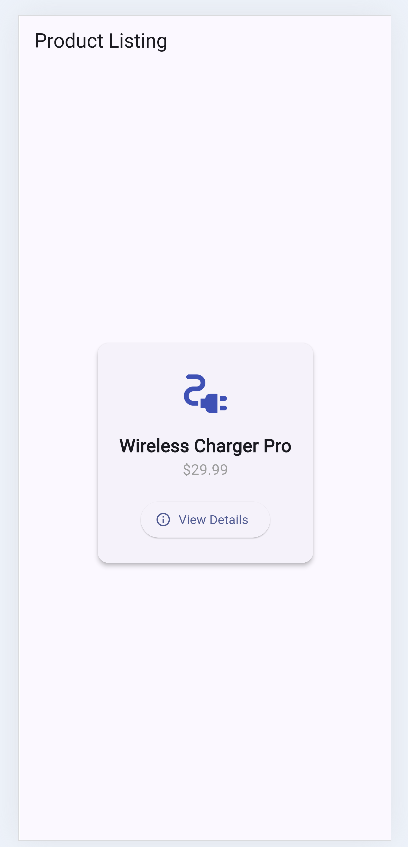

# Overlay Widget Demo

**One-liner:** The `Overlay` widget renders floating UI layers on top of the entire app, perfect for tooltips, popovers, and custom modals.

---

## Run Instructions

1. Make sure Flutter is installed: https://docs.flutter.dev/get-started/install
2. Clone the repo: `git clone https://github.com/YOUR_USERNAME/overlay_demo.git`
3. Navigate in: `cd overlay_demo`
4. Get packages: `flutter pub get`
5. Run: `flutter run`

---

## Three Attributes Covered

| Property | Type | What It Does |
|---|---|---|
| `opaque` | `bool` | Blocks interaction with widgets behind the overlay when `true` |
| `maintainState` | `bool` | Keeps the overlay's widget state alive when `true`, even while hidden |
| `builder` | `WidgetBuilder` | Required callback that returns the widget tree displayed by the overlay |

---

## 📸 Screenshots

